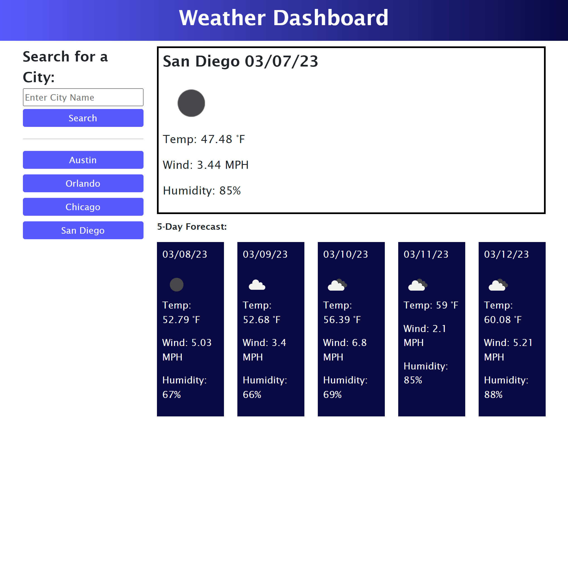
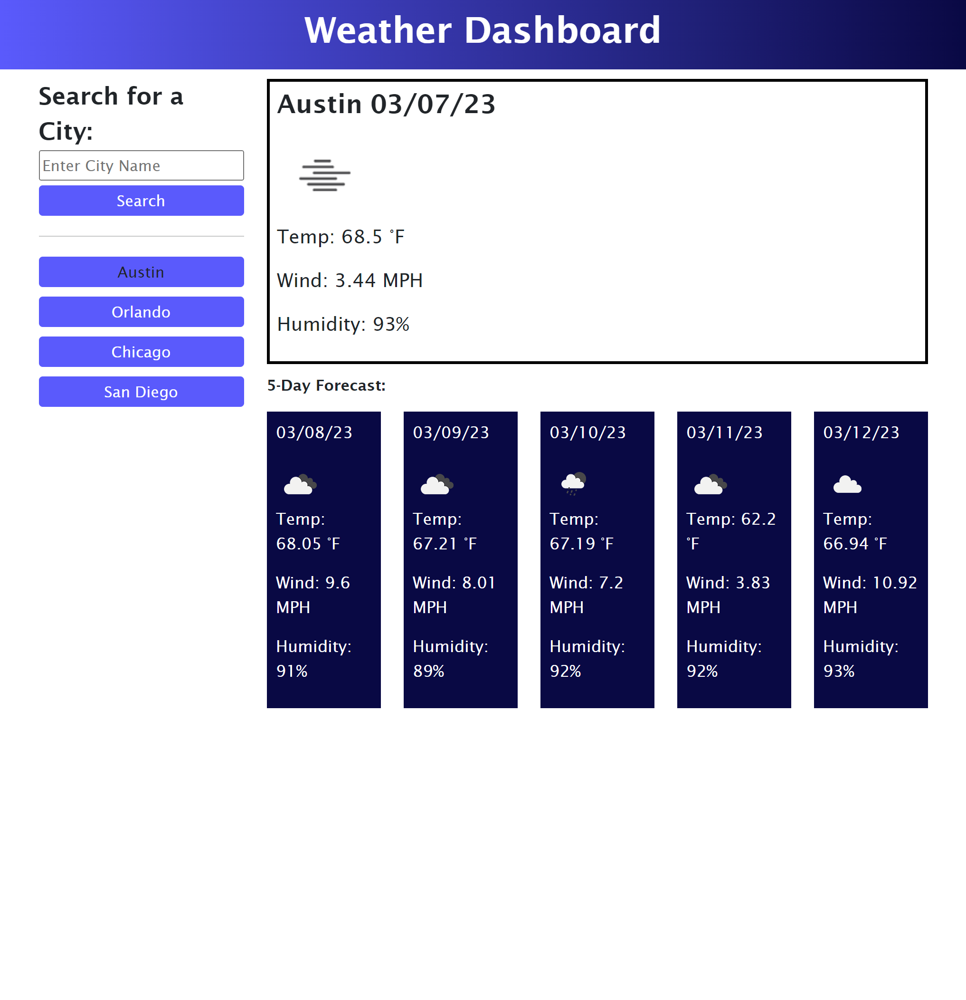

# Weather Dashboard

## Description
- My motivation for this project was to learn how to use a server-side API (weather API) to retrieve and display data. 
- I built this project so the user can search a city name and view the current and future weather forecast for that city. I also built this project to practice creating HTML, CSS, and JavaScript files from scratch. I was also able to practice using Bootstrap to create a responsive layout, and I got more practice with jQuery and Day.js as well. 
- The problem this project solves is not knowing the weather conditions in other cities. For example, if the user needs to know the weather forecast for a city that they'd like to travel to, this webpage allows them to do that. 
- I learned how to use the fetch method to retrieve data from a server-side API; in this case, I used a weather API from openweathermap.org. I also learned how to display that data on my webpage using JavaScript. I learned how to use Bootstrap to create a responsive layout for my webpage, and I got more experience using jQuery and Day.js. I learned how to use Day.js to add a day to the current date and display those dates on my page in the format that I wanted. I also learned how to clear the input field once the user searches for a city. I learned how to use template literals to dynamically format my webpage.
- I want to acknowledge here that I did not add alt attributes to the images for the weather icon because I knew that it was subject to change, and I wasn't sure if adding alt attribute to the images would be a good idea because of that. 

## Usage
- To use this webpage, you will type a city name into the search bar to the left of the screen. Once you do, you will be presented with the city name, the date, an icon representation of weather conditions, the temperature, the humidity, and the wind speed for the current day and the next five days. After searching for a city, it will be added below to your search history. There, you can click on the city name of a previous search and be presented with the current and future weather conditions for that city again. 

## Credits
- I referenced this website for creating my search bar: https://www.w3schools.com/howto/howto_css_search_button.asp
- I referenced this website for creating the linear gradient background for the header of my webpage: https://www.w3schools.com/css/css3_gradients.asp
- I referenced this website for how to use my API key: https://coding-boot-camp.github.io/full-stack/apis/how-to-use-api-keys
- I referenced this for how to format my date into numbers: https://day.js.org/docs/en/display/format
- I referenced this for how to add a day to the current date: https://day.js.org/docs/en/durations/add
- I referenced this website for how to clear the input filed once the user searched for a city: https://stackoverflow.com/questions/20416803/how-do-i-clear-the-previous-text-field-value-after-submitting-the-form-with-out
- AskBCS (username mcavazos524) helped me with lines 128-136 and line 154, which is the function that handles taking the user back to a city's weather forecast from their search history and the click event involved with that. 
- My tutor, Alexis Gonzalez, helped me use Bootstrap to create a responsive layout for my webpage. He also helped me create my loadStorage() and saveToStorage() function. He also taught me how to use template literals, and helped me with the code on lines 89-95 and 99-112. With his help, I was able to use a for loop. This allowed me to clean up my code quite a bit in both my HTML file and JavaScript file. 

